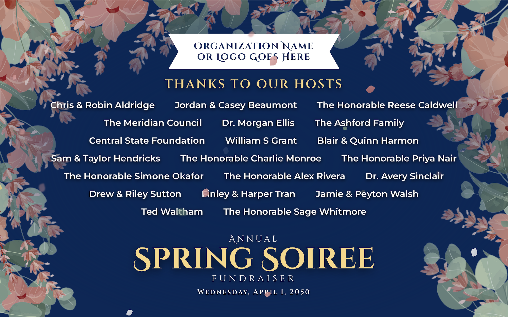

# Interactive Event Poster Template



### [🎥 View the Live Demo](https://ryanmarch.github.io/springEventPoster/)


An animated, browser-based event poster designed for large-format displays and presentation screens. Built for event fundraisers and managed as a live kiosk display.

---

## Overview

This is a single-page, zero-dependency web app that renders a fully animated event poster. It was designed to run fullscreen on a laptop or large display at the venue, and includes a hidden controls panel for real-time customization without disrupting the presentation.

The poster features:

- Animated falling petals (cherry blossoms, leaves, and gold petals)
- Swaying floral border decorations
- An animated SVG flower border frame
- A live host committee list with dynamic font scaling
- QR code overlays for event registration and membership
- A management panel for live adjustments
- A help menu that includes asset guidelines for logos and images

---

## File Structure

```
soireeHosts_v4/
├── index.html          # App structure and sample markup
├── script.js           # All app logic (EventPoster class)
├── styles.css          # All styles, animations, and layout
└── assets/
    ├── fonts/          # Local font files (Cinzel, Montserrat)
    ├── images/
    │   ├── flower_border_transparent.svg        # Animated SVG border frame
    │   ├── pink-blooms-1.png                    # Corner flower asset (top-left)
    │   ├── pink-blooms-with-stem.png            # Corner flower asset (top-right)
    │   ├── pink-blooms-2.png                    # Corner flower asset (bottom)
    │   ├── pink-blooms.png                      # Side flower asset
    │   └── leafy-stem.png                       # Side leaf asset
    └── favicons/
        └── favicon.png                          # Flower favicon
```
---

## Keyboard Shortcuts

| Key | Action |
|-----|--------|
| `F` | Toggle fullscreen |
| `Q` | Toggle the Options panel |
| `C` | Toggle the Customize Appearance section (panel must be open) |
| `A` | Toggle the Add/Remove Hosts section (panel must be open) |
| `R` | Reset appearance to defaults (Customize section must be open) |
| `Esc` | Close panel or dismiss the Add Host form |
| Hold `\` | Factory reset (clears all localStorage and reloads) |

**Hidden trigger:** Hold-clicking the top-right corner of the screen for ~700ms also opens the Options panel (useful when you can't use the keyboard).

---

## Options Panel Features

### Quick Controls
- **Fullscreen toggle** — puts the browser into fullscreen mode and activates Wake Lock to prevent the screen from sleeping
- **Performance stats** — live FPS counter, screen resolution, fullscreen session timer, and Wake Lock status

### Customize Appearance
- **Petal Count** — number of falling petals on screen at once
- **Windiness** — frequency of wind gusts
- **Fall Speed / Tumble Speed** — petal physics
- **Wave Strength** — how dramatically the corner flowers sway
- **Pause Petals / Pause Waves** — freeze animations independently
- **Host Layout** — Justify, Centered, or Columns
- **Host Text Size / Max Width** — scale and constrain the host list
- **Backdrop Opacity** — fade the overlay behind the host list
- **Vertical / Horizontal Inset** — adjust content margins from the border
- **Show/Hide** toggles for: logo, event title, date, host list, flower border
- **QR code overlays** — Soiree registration and Membership store
- **Disable auto-fullscreen** — prevent the 3-second countdown on first load

### Add and Remove Hosts
- Add host names one at a time via a form (supports Enter key, detects duplicates)
- Once any host is added by the user, the default/sample names are permanently replaced
- Remove individual hosts; recently removed hosts can be put back
- All host data is persisted in `localStorage`

---

## Persistence

All settings and host data are saved to `localStorage` so they survive page refreshes and browser restarts. Keys used:

| Key | Contents |
|-----|----------|
| `poster-settings` | All slider/toggle state |
| `poster-added-hosts` | User-added host names |
| `poster-removed-hosts` | Recently removed host names |
| `poster-fullscreen-intent` | Whether fullscreen was active before a reload |
| `poster-has-ever-added-host` | Whether the default hosts have been replaced |

To fully reset to factory defaults, hold the `\` key until the progress bar completes.

---

## Display Notes

- **Recommended viewport:** 1280×800px or larger. A "Larger Display Recommended" screen is shown on smaller devices, with an option to bypass.
- **Optimized for:** 1920×1080 and 2550×1440 displays. The layout includes resolution-aware CSS scaling for 1440p.
- **Wake Lock:** Uses the Screen Wake Lock API where available. Falls back to a silent looping video element to keep the screen awake on unsupported browsers.
- **Auto-fullscreen:** After a refresh while fullscreen was active, the poster will re-enter fullscreen automatically. This can be turned off.
- **Fonts**: Uses Cinzel, Cinzel Decorative, and Montserrat. Fonts are hosted locally in `assets/fonts/`.

---

## Event Details (Template)

| Field | Value |
|-------|-------|
| Event Title |
| Date |
| Organization Name or Logo |
| Event Subtitle |
| Left QR Code |
| Right QR Code |

---

## Version History

| Version | Notes |
|---------|-------|
| v5 | Adds host management, content editing, color picker, local font hosting, auto-fullscreen option, high-res display optimizations, responsive font scaling, and small-screen handler. |
| v4 | Adds live host management, factory reset, auto-fullscreen, and responsive layouts. |
| v1–v3 | Earlier iterations with static host lists and limited controls. |

---