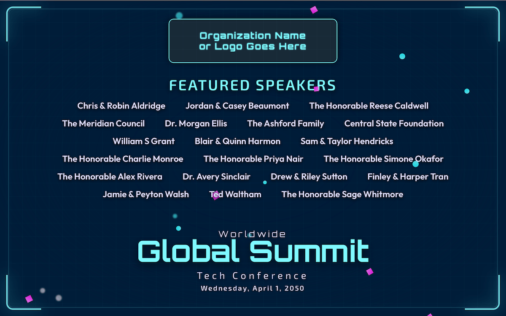
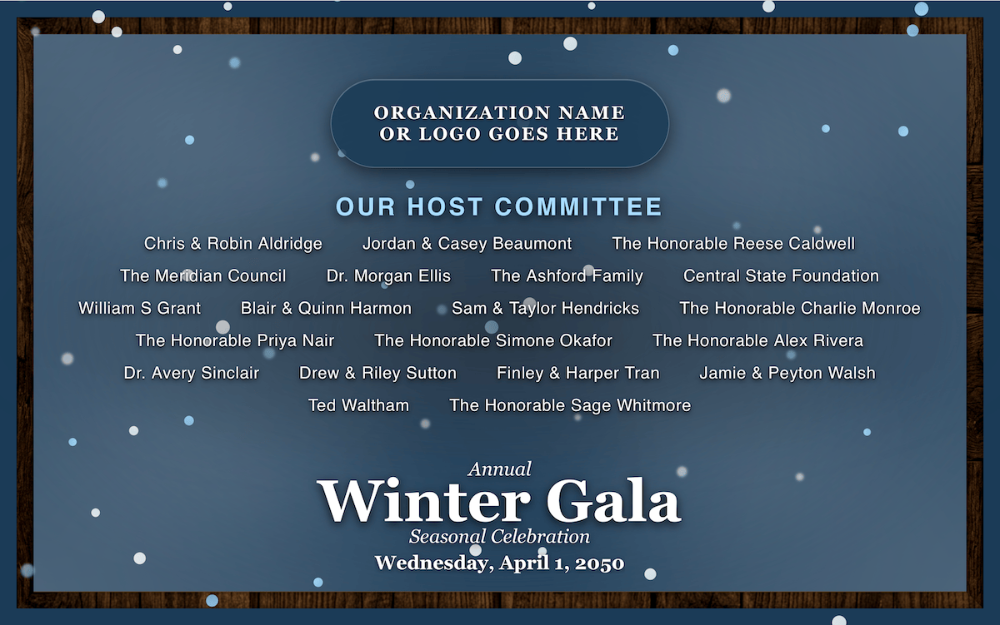
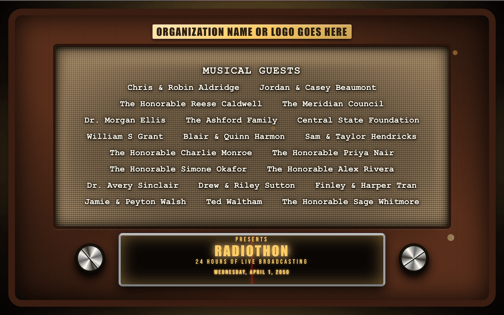
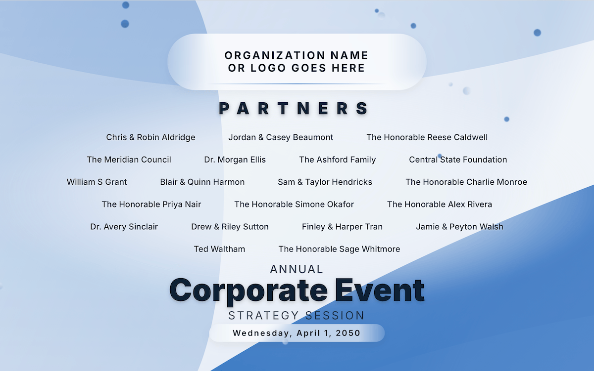

  <h1>Interactive Event Poster</h1>
  
<i>A professional, browser-based display for gala fundraisers and high-end venues.</i>

  

   

  <video src=".github/assets/eventPoster.mp4" 
         poster=".github/assets/eventPoster.png" 
         width="100%" controls muted autoplay loop>
    
  </video>

## Overview
The **Interactive Event Poster** is a professional-grade, browser-based display tool designed for gala fundraisers, non-profit events, and high-end venue kiosks. It replaces static slides and paper posters with a living, breathing digital poster that captures attention and elevates the atmosphere of any physical space.

Designed with a "set it and forget it" philosophy, this tool allows event managers to customize every detail in real-time. You can adjust everything from the physics of falling petals to the names of host committee members to ensure your presentation is always perfect without needing a developer.

## Key Benefits
*   **Easy To Use:** Simply open the file and you're ready to go.
*   **Event Reliability:** Built-in features prevent the screen from sleeping and ensure the poster automatically recovers if the power blinks or the page refreshes.
*   **Your Branding, Your Customization:** All customizations, including uploaded logos and QR codes, are saved directly into your browser. They persist through refreshes and restarts, so your work is never lost.
*   **Live Edits, No Disruptions:** A management panel allows you to update text and settings on the fly without having to edit code.

## Features

### Atmospheric Elegance
*   **Multi-Atmosphere Particle Engine:** Depending on your theme, experience falling cherry blossoms, snowflakes, dust motes, or celebratory geometric particles subtly drifting through the display.
*   **Adjustable Physics:** Fine-tune wind frequency, fall speed, and tumble rotation to create a natural environment that fits your needs.
*   **Theme-Specific Frames:** From elegant floral borders to rustic wood cabinets and frosted glass, each theme provides a unique window into your event.
*   **Dynamic Visual Identity:** Instantly swap between professional, seasonal, or high-energy themes to match the tone of your gathering.

## Themes
Choose from five curated visual identities, each with its own unique particle engine and decorative frame:
*   **Spring Blossom:** Delicate cherry blossoms and elegant floral frames.
*   **Digital Grid:** High-tech neon accents and techy-glass with sci-fi light beams.
*   **Alpine Winter:** Frosted glass window and a rustic wood frame with a gentle snowfall effect.
*   **Vintage Radio:** Warm wood textures, with a tuning needle and floating particles of light.
*   **Corporate Pro:** Modern geometric shapes and professional, abstract gradients.

## Screenshots
| **Spring Blossom** – *Fresh & Elegant* |
|:---:|
|  |
| **Digital Grid** – *High-Tech & Modern* |
|  |
| **Alpine Winter** – *Frosty & Rustic* |
|  |
| **Vintage Radio** – *Warm & Nostalgic*|
|  |
| **Corporate Pro** – *Sleek & Professional* |
|  |

### Content Editor
*   **Custom-To-You Branding:** Add your organization name and upload custom logos directly in the browser.
*   **Event Details:** Change the event title, subtitle, and date via the Edit panel.
*   **Smart QR Display:** Overlay QR codes for event registration or donation pages. Upload your own images and they remain saved for future use.
*   **Visual Layout Control:** Independently toggle the visibility of every element, including the logo, title, date, the host list, and even the background animations.

### Name Management
*   **Seamless Entry:** Easily add or remove names one at a time via a clean, simple form.
*   **Interactive Removal:** Remove a name quickly by simply holding down on a name, or choose it from the list to remove it.
*   **Smart Font Scaling:** The names list automatically adjusts its font size and layout to fit your screen perfectly, whether you have 5 names or 50.
*   **Flexible Layout Modes:** Choose between Justified, Centered, or Column-based layouts to suit your aesthetic preferences.
*   **Safety Net:** Recently removed names are stored in a "Recently Removed" list within the menu, allowing you to restore them with a single click if you make a mistake.

### Appearance & Performance Settings
*   **Hardware Wake Lock:** Automatically tells the computer to stay awake, preventing embarrassing screensavers or sleep modes during your event.
*   **Auto-Fullscreen Recovery:** Remembers your fullscreen state. If the browser reloads, it's easy to jump back into presentation mode.
*   **Touch-Friendly Hotspot:** No keyboard? No problem. A hidden "hold" zone in the top-right corner allows you to open settings with a simple touch or tap-and-hold.
*   **Performance Engineering:**
    *   **Frame Rate Limiter:** Cap performance at 30, 60, 90, or 120 FPS to save battery or ensure buttery-smooth motion on high-refresh displays.
    *   **Smooth Transitions:** Toggle UI animations for a snappier feel or a more cinematic experience.
*   **Precision Styling Lab:**
    *   **Text Backdrop Strength:** Control the legibility of names against complex backgrounds.
    *   **Layout Control:** Fine-tune the **Max Width**, **Vertical Spacing**, and **Horizontal Spacing** to fit any screen bezel.
    *   **Live Color Picker:** Match the background and accent colors to your brand's specific palette.
*   **Adjustable Text Backdrop:** Control the opacity of the host list background to balance readability with the beauty of the animations.
*   **Layout Control:** Adjust vertical and horizontal insets to ensure content is perfectly framed, regardless of your screen's bezel or resolution.

## Management Interface
*Everything you see on the poster is controlled via an intuitive management interface in the app. No code required.*

| **Main Controls** | **Name Management** |
|:---:|:---:|
|  |  |
| *Live stats & toggles.* | *Real-time list editing.* |

| **Content Editor** | **Appearance Settings** | **Help & Guidelines** |
|:---:|:---:|:---:|
|  |  |  |
| *Logos, titles, and QRs.* | *Physics & layout sliders.* | *Hotkeys & asset specs.* |

## Getting Started
1.  **Launch:** Open the `index.html` file in any modern web browser.
2.  **Enter Fullscreen:** Press **'F'** on your keyboard to enter presentation mode.
3.  **Open Options:** Press **'Q'** (Quick Controls) to start customizing your poster.
4.  **Set Your Branding:** Upload your logo and QR codes, set your colors, and add your host names.
5.  **Display:** Plug your computer into a large display or projector and let it run!

## Keyboard Shortcuts

### Quick Access Hotkeys
| Key | Action |
|-----|--------|
| `F` | Toggle fullscreen |
| `Q` | Toggle the Options panel |
| `E` | Edit Poster Text |
| `C` | Toggle the Customize Appearance section |
| `A` | Toggle the Add/Remove Names section |
| `R` | Reset appearance to defaults (in Customize section) |
| `?` | Show Help Menu |
| `Esc` | Close panel or dismiss forms |
| Hold `\` | **Factory Reset:** Wipe all local data and restore defaults |

### Other Triggers
*   **Open Menu:** Tap and hold the top-right corner of the screen to open the settings panel without a keyboard.
*   **Remove Host:** Tap and hold any name in the Host Committee list to remove it from the display.

## Options Panel Features

### Quick Controls
- **Fullscreen toggle** — puts the browser into fullscreen mode and activates Wake Lock to prevent the screen from sleeping
- **Performance stats** — live FPS counter, screen resolution, fullscreen session timer, and Wake Lock status

### Customize Appearance
- **Theme Switcher** — Choose from curated visual identities like Corporate Pro, Alpine Winter, Vintage Radio, or Spring Blossom.
- **Particle Dynamics** — Adjust the count, speed, and windiness of atmospheric effects (petals, snow, etc.).
- **Intensity Controls** — Scale the movement of background frames and swaying elements.
- **Theme-Specific Controls** — UI labels automatically update to match your theme (e.g., "Petal Count" vs "Snowflake Count").
- **Host Layout** — Justify, Centered, or Columns.
- **Host Text Size / Max Width** — Scale and constrain the host list.
- **Vertical / Horizontal Inset** — Adjust content margins from the border.
- **Color Palettes** — Change background and accent colors using theme-specific swatches or a custom color picker.
- **Backdrop Opacity** — Fade the overlay behind the host list for better legibility.
- **QR Code Overlays** — Independently toggle left and right QR code areas.
- **Show/Hide Toggles** — Logo, event title, date, host list, and theme frames.
- **Disable auto-fullscreen** — Prevent the fullscreen restoration after refresh.

### Add and Remove Hosts
- Add host names one at a time via a form (supports Enter key, detects duplicates)
- Once any host is added by the user, the default/sample names get replaced
- Remove individual hosts; recently removed hosts can be put back

### Asset Guidelines

-   **Logos:** PNG files are recommended. Ensure transparency is preserved for best results.
-   **QR Codes:** Any standard QR code image format (PNG, JPG, SVG) will work. Ensure the image is clear and high resolution for best readability.

---

## Project Architecture (For Developers)

This project is built as a lightweight, zero-dependency "Vanilla" web application. It is designed for maximum performance and easy hosting on services like GitHub Pages.

### File Structure
*   `index.html`: The core structure and entry point.
*   `js/main.js`: Initializes the application and handles loading states.
*   `js/EventPoster.js`: The central orchestrator managing state, persistence, and layout.
*   `js/modules/`:
    *   `ThemeManager.js`: Handles visual themes, color derivations, and CSS variables.
    *   `ParticleEngine.js`: Manages the high-performance atmospheric animation system.
    *   `UIController.js`: Manages all user interactions, keyboard shortcuts, and form logic.
    *   `Constants.js`: Centralized configuration for defaults and storage keys.
*   `styles.css`: Core layout engine and base utility classes.
*   `ui-components.css`: Modern, modular UI styles for the management panel.
*   `theme-[name].css`: Specific styling and animation overrides for each theme.

### Persistence Strategy
The application uses the browser's `localStorage` API to store all user configurations. This ensures that:
1.  Custom text and host lists are preserved.
2.  Uploaded images (stored as Base64 strings) remain available across sessions.
3.  Display settings (petal count, speed, colors) are remembered.

This architecture allows the project to remain entirely client-side, requiring no backend or database to function.

## Technical Specifications
*   **Language:** HTML5, CSS3, ES6+ JavaScript.
*   **Compatibility:** Chrome, Edge, Safari, Firefox.
*   **Optimized For:** 1080p (FHD) and 1440p (QHD) displays.
*   **Reliability:** Includes a silent video fallback for the Wake Lock API on older browsers.

---

### Display Notes

- **Recommended viewport:** 1280×800px or larger. A "Larger Display Recommended" screen is shown on smaller devices, with an option to bypass.
- **Optimized for:** 1920×1080 and 2550×1440 displays. The layout includes resolution-aware CSS scaling for 1440p.
- **Wake Lock:** Uses the Screen Wake Lock API where available. Falls back to a silent looping video element to keep the screen awake on unsupported browsers.
- **Auto-fullscreen:** After a refresh while fullscreen was active, the poster will re-enter fullscreen automatically. This can be turned off.

## Version History

| Version | Notes |
|---------|-------|
| v6 | **The "Themes" Update:** Introduced Theme Engine with 5 curated themes (Corporate Pro, Vintage Radio, Alpine Winter, Digital Grid, Spring Blossom). Added dynamic particle system, improved color swatch management, and enhanced UI labels. Complete architectural refactor under the hood for greater extensibility. |
| v5 | Adds host management, content editing, color picker, local font hosting, auto-fullscreen option, high-res display optimizations, responsive font scaling, and small-screen handler. |
| v4 | Adds live host management, factory reset, auto-fullscreen, and responsive layouts. |
| v1–v3 | Earlier iterations with static host lists and limited controls. |

---

*Created for event fundraisers and beautiful public displays.*
