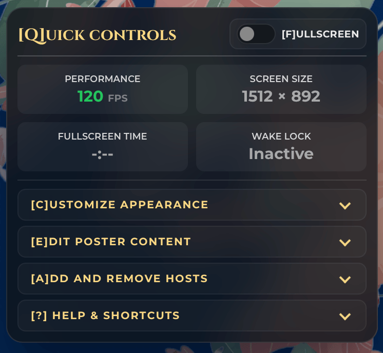
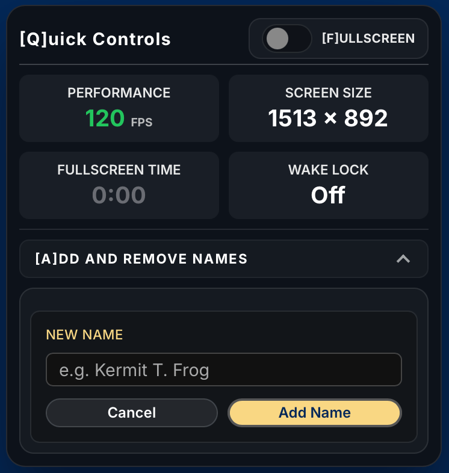
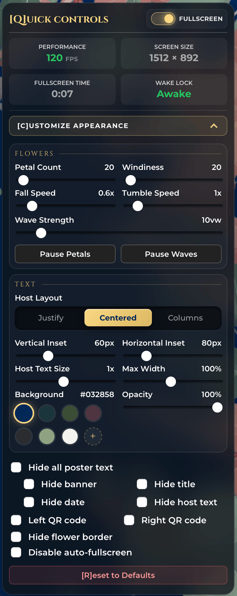
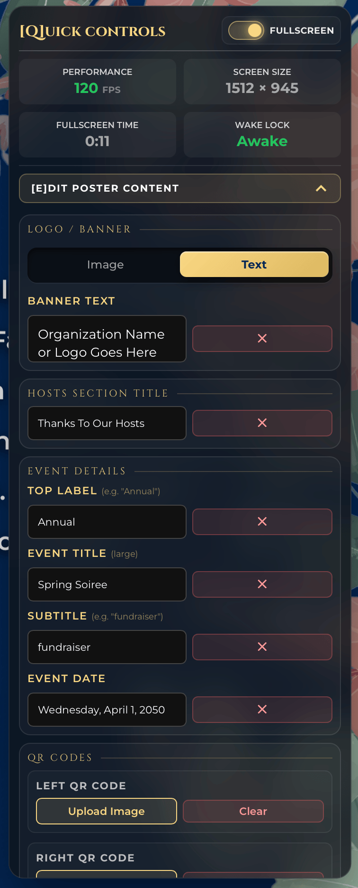
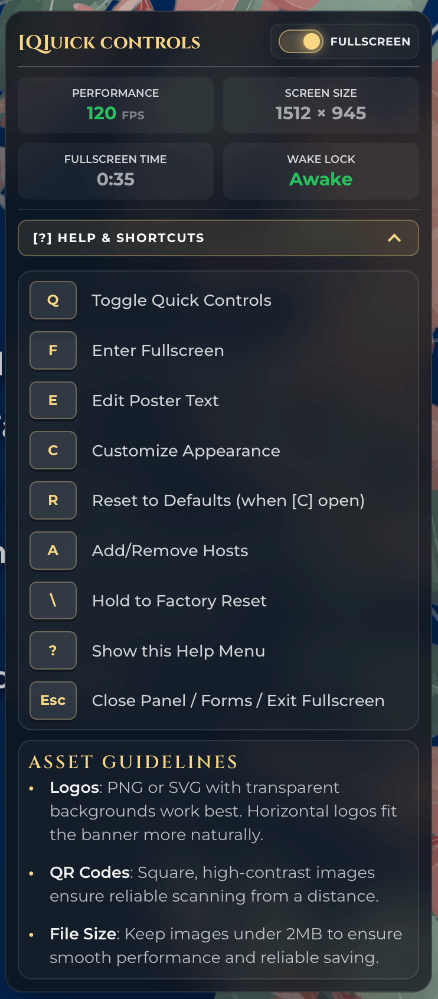

  <h1> Interactive Event Poster</h1>
  
<i>A professional, browser-based display for gala fundraisers and high-end venues.</i>

  

   

  

## Overview
The **Interactive Event Poster** is a professional-grade, browser-based display tool designed for gala fundraisers, non-profit events, and high-end venue kiosks. It replaces static slides and paper posters with a living, breathing digital centerpiece that captures attention and elevates the atmosphere of any physical space.

Designed with a "set it and forget it" philosophy, this tool allows event managers to customize every detail in real-time—from the physics of falling petals to the names of host committee members—ensuring your presentation is always perfect, without ever needing a developer.

## Key Benefits
*   **Easy To Use:** Simply open the file and you're ready to go.
*   **Event Reliability:** Built-in features prevent the screen from sleeping and ensure the poster automatically recovers if the power blinks or the page refreshes.
*   **Your Branding, Your Customization:** All customizations—including uploaded logos and QR codes—are saved directly into your browser. They persist through refreshes and restarts, so your work is never lost.
*   **Live Edits, No Disruptions:** A management panel allows you to update text and settings on the fly without having to edit code.

## Features

### Atmospheric Elegance
*   **Dynamic Flower Petal System:** See cherry blossoms, autumn leaves, or celebratory gold petals subtly drift by to match your event's season and theme.
*   **Adjustable Physics:** Fine-tune wind frequency, fall speed, and tumble rotation to create a natural environment that fits your needs.
*   **Swaying Floral Elements:** Border decorations and stems respond to a virtual "breeze," adding depth and motion to the display.
*   **Animated SVG Border:** An elegant, animated floral frame that ties the entire visual experience together.

### Live Content Studio
*   **Custom-To-You Branding:** Add your organization name and upload custom logos directly in the browser.
*   **Event Details:** Change the event title, subtitle, and date instantly via the Edit panel.
*   **Smart QR Display:** Overlay QR codes for event registration or donation pages. Upload your own images and they remain saved for future use.
*   **Visual Layout Control:** Independently toggle the visibility of every element, including the logo, title, date, the host list, and even the flowers.

### Intelligent Host Committee Management
*   **Seamless Entry:** Easily add or remove host names one at a time via a clean, simple form.
*   **Interactive Removal:** Remove a name quickly by simply holding down on a name in the list to remove it.
*   **Smart Font Scaling:** The committee list automatically adjusts its font size and layout to fit your screen perfectly, whether you have 5 names or 50.
*   **Flexible Layout Modes:** Choose between Justified, Centered, or Column-based layouts to suit your aesthetic preferences.
*   **Safety Net:** Recently removed names are stored in a "Recently Removed" listwithin the menu, allowing you to restore them with a single click if you make a mistake.

### Venue-Optimized Controls
*   **Hardware Wake Lock:** Automatically tells the computer to stay awake, preventing embarrassing screensavers or sleep modes during your event.
*   **Auto-Fullscreen Recovery:** Remembers your fullscreen state. If the browser reloads, it will automatically jump back into presentation mode.
*   **Touch-Friendly Hotspots:** No keyboard? No problem. A hidden "hold" zone in the top-right corner allows you to open settings with a simple touch or click-and-hold.
*   **Precision Styling Lab:**
    *   **Adjustable Background Color:** Choose from the built-in designer background colors or use the live color picker to match the background to your brand's specific palette.
    *   **Layout Control:** Adjust vertical and horizontal insets to ensure content is perfectly framed, regardless of your screen's bezel or resolution.
    *   **Backdrop Styling:** Control the opacity of the host list background to balance readability with the beauty of the animations.

## Quick Controls
*Everything you see on the poster is controlled via a hidden, intuitive management interface. No code required.*

| **Quick Controls** | **Add/Remove Hosts** |
|:---:|:---:|
|  |  |
| *Options menu and live stats.* | *Real-time list management.* |

| **Customize Appearance** | **Edit Poster Content** | **Help & Guidelines** |
|:---:|:---:|:---:|
|  |  |  |
| *Physics, speed, and colors.* | *Logos, titles, and QR codes.* | *Keyboard shortcuts and asset specifications.* |

## Getting Started
1.  **Launch:** Open the `index.html` file in any modern web browser.
2.  **Enter Fullscreen:** Press **'F'** on your keyboard to enter presentation mode.
3.  **Open Options:** Press **'Q'** (Quick Controls) to start customizing your poster.
4.  **Set Your Branding:** Upload your logo and QR codes, set your colors, and add your host names.
5.  **Display:** Plug your computer into a large display or projector and let it run!

## Keyboard Shortcuts

### Quick Access Hotkeys
| Key | Action |
|-----|--------|
| `F` | Toggle fullscreen |
| `Q` | Toggle the Options panel |
| `E` | Edit Poster Text |
| `C` | Toggle the Customize Appearance section (panel must be open) |
| `A` | Toggle the Add/Remove Hosts section (panel must be open) |
| `R` | Reset appearance to defaults (Customize section must be open) |
| `?` | Show Help Menu |
| `Esc` | Close panel or dismiss the Add Host form |
| Hold `\` | **Factory Reset:** Clear all settings and start from scratch |

### Other Triggers
*   **Open Menu:** Tap and hold the top-right corner of the screen to open the settings panel without a keyboard.
*   **Remove Host:** Tap and hold any name in the Host Committee list to remove it from the display.

## Options Panel Features

### Quick Controls
- **Fullscreen toggle** — puts the browser into fullscreen mode and activates Wake Lock to prevent the screen from sleeping
- **Performance stats** — live FPS counter, screen resolution, fullscreen session timer, and Wake Lock status

### Customize Appearance
- **Petal Count** — number of falling petals on screen at once
- **Windiness** — frequency of wind gusts
- **Fall Speed / Tumble Speed** — petal physics
- **Wave Strength** — how dramatically the corner flowers sway
- **Pause Petals / Pause Waves** — freeze animations independently
- **Host Layout** — Justify, Centered, or Columns
- **Host Text Size / Max Width** — scale and constrain the host list
- **Vertical / Horizontal Inset** — adjust content margins from the border
- **Background Colors** — change background colors using the built-in designer colors or choose your own with the color picker
- **Backdrop Opacity** — fade the overlay behind the host list
- **QR code overlays** — Individually show or hide left and right QR code areas
- **Show/Hide** toggles for: logo, event title, date, host list, flower border
- **Disable auto-fullscreen** — prevent the fullscreen restoration after refresh

### Add and Remove Hosts
- Add host names one at a time via a form (supports Enter key, detects duplicates)
- Once any host is added by the user, the default/sample names get replaced
- Remove individual hosts; recently removed hosts can be put back

### Asset Guidelines

-   **Logos:** PNG files are recommended. Ensure transparency is preserved for best results.
-   **QR Codes:** Any standard QR code image format (PNG, JPG, SVG) will work. Ensure the image is clear and high resolution for best readability.

---

## Project Architecture (For Developers)

This project is built as a lightweight, zero-dependency "Vanilla" web application. It is designed for maximum performance and easy hosting on services like GitHub Pages.

### File Structure
*   `index.html`: The core structure and entry point.
*   `script.js`: Contains the `EventPoster` class, handling all physics, state management, and persistence logic.
*   `styles.css`: Advanced CSS animations, layout systems, and responsive design tokens.
*   `/assets`: Local font files (Cinzel, Montserrat) and optimized SVG/PNG visual assets.

### Persistence Strategy
The application uses the browser's `localStorage` API to store all user configurations. This ensures that:
1.  Custom text and host lists are preserved.
2.  Uploaded images (stored as Base64 strings) remain available across sessions.
3.  Display settings (petal count, speed, colors) are remembered.

This architecture allows the project to remain entirely client-side, requiring no backend or database to function.

## Technical Specifications
*   **Language:** HTML5, CSS3, ES6+ JavaScript.
*   **Compatibility:** Chrome, Edge, Safari, Firefox.
*   **Optimized For:** 1080p (FHD) and 1440p (QHD) displays.
*   **Reliability:** Includes a silent video fallback for the Wake Lock API on older browsers.

---

### Display Notes

- **Recommended viewport:** 1280×800px or larger. A "Larger Display Recommended" screen is shown on smaller devices, with an option to bypass.
- **Optimized for:** 1920×1080 and 2550×1440 displays. The layout includes resolution-aware CSS scaling for 1440p.
- **Wake Lock:** Uses the Screen Wake Lock API where available. Falls back to a silent looping video element to keep the screen awake on unsupported browsers.
- **Auto-fullscreen:** After a refresh while fullscreen was active, the poster will re-enter fullscreen automatically. This can be turned off.

## Version History

| Version | Notes |
|---------|-------|
| v5 | Adds host management, content editing, color picker, local font hosting, auto-fullscreen option, high-res display optimizations, responsive font scaling, and small-screen handler. |
| v4 | Adds live host management, factory reset, auto-fullscreen, and responsive layouts. |
| v1–v3 | Earlier iterations with static host lists and limited controls. |

---

*Created for event fundraisers and beautiful public displays.*
